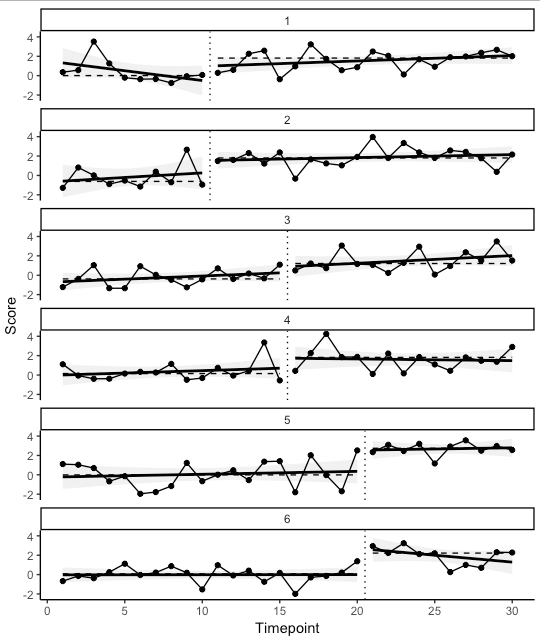

# SCED

An R package for analysis of AB Single Case Experiment Design data using [exact tests](https://en.wikipedia.org/wiki/Exact_test) and [robust effect sizes](https://www.ncbi.nlm.nih.gov/pubmed/18331151).

## Author

Ian Hussey (ian.hussey@ugent.be)

## License

GPLv3+

## Installation

```R
install.packages("devtools")
library(devtools)
install_github("ianhussey/SCED")
library(SCED)
```

## Main functions 

### simulate_ab_data()

Simulate data that meets the required format of `sced_analysis()` and `sced_plot()` for testing/demonstration (via the simstudy package).

### sced_plot()

Panes represent individual participants with ID numbers included above each. Vertical dotted lines separate experimental conditions A and B (e.g., pre and post intervention). Horizontal dashed lines represent median values in each expeirmental condition. Linear regression lines and error bars are also included to higlight change trends within conditions. 



### sced_analysis()

Calculates the following statistics:

- An exact *p* value for using a non-parametric permutation test (via the coin package). These are insensitive to distributions and outliers. False positive rates are therefore equal to the alpha value, rather than approximate to it. Assesses whether the values of the data points in condition B are different to condition A.
- Median difference score. Difference score between the median value of condition A and condition B. Median values are employed given their greater robustness. Unstandardized values such as the median difference score can be useful in order to assess clinical significance, and when used in conjunction with non-parametric effect sizes (such as *A*, below), which can suffer from floor/ceiling effects.  
- Effect size *A* ([Ruscio, 2008](https://www.ncbi.nlm.nih.gov/pubmed/18331151)), a non-parametric, probabalistic effect size. Bootstrapping is used to calculated the median value and its 95% confidence intervals. This is also calculated via a permutation method, and is therefore robust/insensitive to outliers and distributions. The original, parametric versions of this test are referred to as the Area Under the Curve (AUC), the Common Language Effect Size (CLES), or the probability of superiority. *A* has an identical range (i.e. a probability between and 1) interpretation (i.e., the probability of a randomly selected time point in condition B being greater than a randomly selected time point in condition A). *A* is therefore also more robust than traditional effect size metrics for SCED such as the % overlap and the % greater than the median.
- Hedges' *g* effect sizes, and its bootstrapped 95% confidence intervals. *g* is a variation of Cohen's *d* that is bias corrected for small sample sizes. It is included here for the sake of familiarity/comparison. However, it is sensitive to the ratio of data points in A vs. B, the normality of the distributions of data in each condition, and the equality of variances of A and B. Bootstrapped CIs serves to mitigate these assumptions somewhat.

### sced_summary()

Convert the output of `sced_analysis()` to a printable table.

## To do

- Highlight the median values in A and B with a different shaped dot?

- How to establish stability at baseline, either retrospectively or in an optional stopping fashion (i.e., optional condition switching once stability has been reached)?

  - Theil-Sen slope would be more robust than the LSE slopes used in the plots. However, optional-transition designs would suffer from the changing power of the test as *n* grows.

- Add additional other terminology for *A* from Parker (2009). 

- Add random effects analysis (e.g., using the PIM package when updated to include random factors) and/or random effects meta analysis (e.g., using the metafor package).

  ​